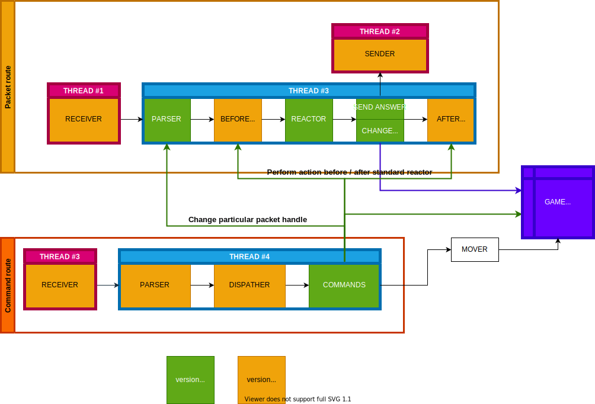

# MinecraftConsoleClient
#### Minecraft Console Client written in Python.  
Based on [Minecraft Modern](https://wiki.vg/Main_Page) documentation page.  

Uses [pycodestyle](https://github.com/PyCQA/pycodestyle), [pydocstyle](https://github.com/PyCQA/pydocstyle) and [prospector](https://github.com/PyCQA/prospector) from [Python Code Quality Authority](https://github.com/PyCQA) <3

## Thanks to:  
  [Thonem](https://github.com/MaksymilianK) for help  
  [MarshalX](https://gist.github.com/MarshalX) for [some code](https://gist.github.com/MarshalX/40861e1d02cbbc6f23acd3eced9db1a0)  

## Available versions:
- 1.12.2:
  - **[Supported packets:](/MinecraftConsoleClient/versions/v1_12_2/FEATURES.md)**
    - Send packets [8 / 34]
    - Receive packets [17 / 117]
  - Other:
    - Bad moving system

## Architecture:

